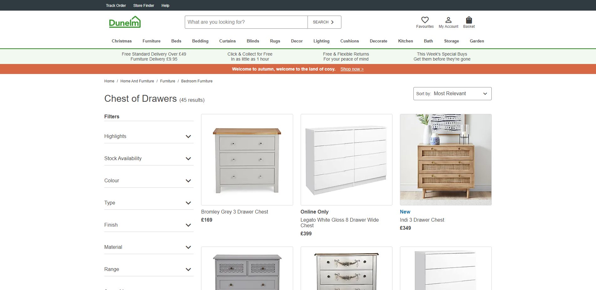

# Dunelm React Mini


## About this Project

Rebuilding one page of the Dunelm website in React for practice.



Desktop only, not responsive.

### Built with

- React
- CSS Modules

## Getting Started

### Prerequisites

- Node

### Installation

1. Install the dependencies.

```
npm i
```

2. Run the react script.

```
npm start
```

## Roadmap

No planned features.

## Release History

- v0.1.0
  - Initial design
